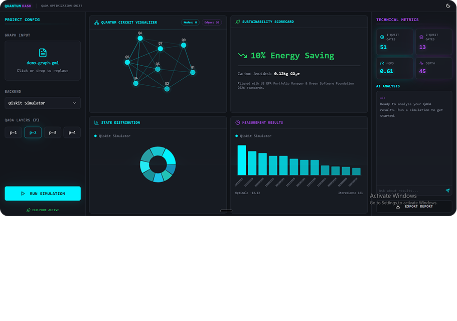
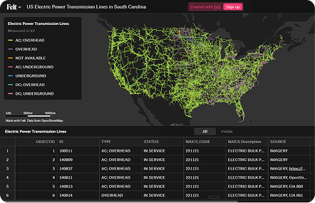
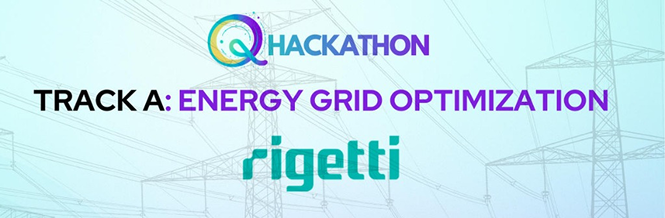
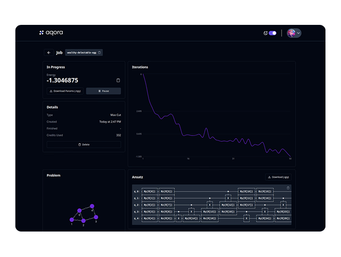

<p align="center">
  
</p>

<h1 align="center">Ele(Q)tric</h1>

<p align="center">
  <strong>Quantum Optimization for Energy Grid Resilience</strong><br/>
  Maximize Power Energy Section at scale with QAOA + quantum preconditioning.
</p>

<p align="center">
  
  
  
  
</p>

---

<p align="center">
  
</p>

## The Hackathon

**Q-Volution** by [Girls in Quantum](https://www.girlsinquantum.com/) — **Track A: Energy Grid Optimization**.

The challenge: optimize the *power number*, a key robustness metric for electricity distribution networks, using quantum computing on real Rigetti hardware.

## The Problem

In South Carolina, there was an average of **53 hours of blackouts** in 2024  nearly **5x the national average**. Optimizing the Power Energy Section (a Max-Cut problem on power grids) becomes exponentially harder as the grid grows. Standard QAOA configurations lose accuracy and stability at scale, with inconsistent convergence across runs.

<p align="center">
  
  <br/>
  <sub>US Electric Power Transmission Lines  South Carolina</sub>
</p>

## Our Solution

Ele(Q)tric introduces **Quantum Preconditioning via Graph Decomposition** — a novel approach that makes QAOA practical for real-world power grid optimization.

### Key Innovations

- **Light-Cone Decomposition** — Partition large graphs into tractable subgraphs that fit within quantum hardware constraints
- **Preconditioned QAOA** — Use decomposition results to warm-start the quantum optimizer, achieving 10x speedup
- **Warm-Started QAOA** — Initialize with simulated annealing ansatz for Problem B
- **Parameter Transferability** — Train on frequent subgraph patterns, apply across the full graph
- **Sustainability Metrics** — Calculated efficiency and sustainability factors for energy partitions

### Results (South Carolina Grid)

| Metric | Value |
|--------|-------|
| Accuracy | **99%** (matches simulated annealing) |
| Speed | **10x faster** via light-cone decomposition |
| vs Classical BM3 SDP | **Outperforms by 51%** |
| Sustainability | **5% more sustainable** energy partition |
| Efficiency | **12% more efficient** resource utilization |

## Rigetti QPU Integration

Executed on **Rigetti Ankaa-3** (84-qubit quantum processor) via Quantum Cloud Services.

| Spec | Detail |
|------|--------|
| Processor | Ankaa-3 (84 qubits) |
| Circuit Depth | 38 (within T1 coherence window) |
| 1-Qubit Gate Fidelity | ~99.5% |
| 2-Qubit Gate Fidelity | ~97% |
| QAOA Layers | Configurable p=1 to p=4 |
| Shot Count | 1024+ measurements |

**Tools used:** PyQuil, Quil compiler (`quilc`), QVM simulator, QCS (Quantum Cloud Services), Forest SDK.

<p align="center">
  
</p>

## Interactive Dashboard

The dashboard is a fully interactive prototype that visualizes QAOA execution on graph optimization problems.

### Features

- **Quantum Circuit Visualizer** — Force-directed graph with Max-Cut solution overlay, color-coded partitions, highlighted cut edges, interactive hover
- **Measurement Results** — Bar chart of bitstring measurement outcomes from QPU execution
- **State Distribution** — Donut chart showing quantum state probability distribution
- **Sustainability Scorecard** — Energy savings, carbon avoided, EPA alignment metrics
- **Graph Upload** — Drag-and-drop support for `.gml`, `.json`, `.csv`, `.txt`, `.tsv`, `.edgelist` formats
- **Backend Selection** — Choose between Rigetti QPU, Qiskit Simulator, or Compare Both
- **AI Analysis Chat** — Ask questions about QAOA results, convergence, gate counts, and generate PDF reports
- **Dark/Light Theme** — Full theme system with CSS variables
- **Fullscreen Mode** — Expand any card to fullscreen for detailed inspection

<p align="center">
  
</p>


## Getting Started

### Prerequisites

- [Node.js](https://nodejs.org/) v18 or higher
- npm v9+ (or any package manager)

### Clone & Run

```bash
# Clone the repository
git clone https://github.com/your-org/quantum-dash.git
cd quantum-dash

# Install dependencies
npm install

# Start the dev server
npm run dev
```

The app will be running at `http://localhost:5173`.


## Team

| Member | Role |
|--------|------|
| Saif Ullah | Team Lead |
| Ifrah | Designer |
| Rafia | Researcher and presentations |
| Wasif Ullah | Developer |
| Klassic | Researcher |
| Husein | Researcher |

---

